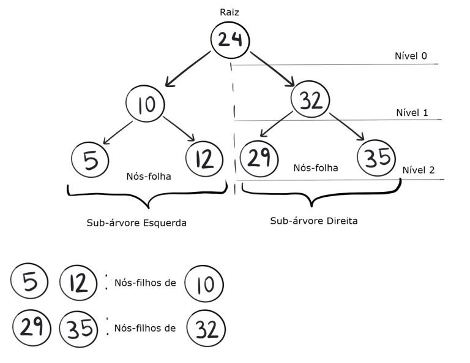
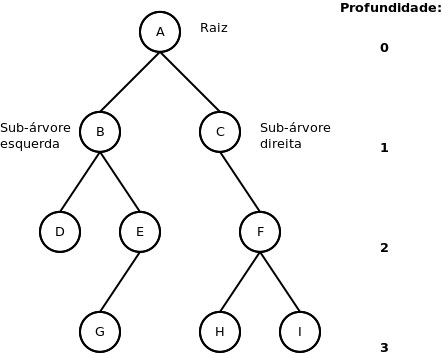

# Binary Tree

Árvore binária (Binary tree) é uma estrutura de dados que se baseia em **nós com até dois filhos**.

## Nomenclatura

### Componentes

Normalmente, o nó principal é chamado de raíz, enquanto seus filhos são chamados de sub-árvores. De maneira particular, se nós que forem finais de sub-árvores, ou seja, não possuírem filhos, são chamados de folhas.

### Tamanho

Uma árvore binária possui duas definições de tamanho. Uma é altura, enquanto a outra é profundidade.

#### Produndidade

Profundidade ou nível é a distância de um nó qualquer até o nó raíz.

#### Altura

A altura é o o maior caminho entre o nó-raíz e uma folha. Por exemplo, uma árvore somente com um nó, possui altura 0. Uma árvore que possui dois nós, possui altura 1. Em suma, é a maior profundidade de uma árvore.

## Tipos de árvore

## Quando usar

## Implementação

## Bibliografia

[USP pdf](http://wiki.icmc.usp.br/images/9/93/ArvoresBin%C3%A1rias_Parte2.pdf)
[IME USP](https://www.ime.usp.br/~pf/algoritmos/aulas/bint.html)
[Geeksforgeeks](https://www.geeksforgeeks.org/binary-tree-data-structure/)
